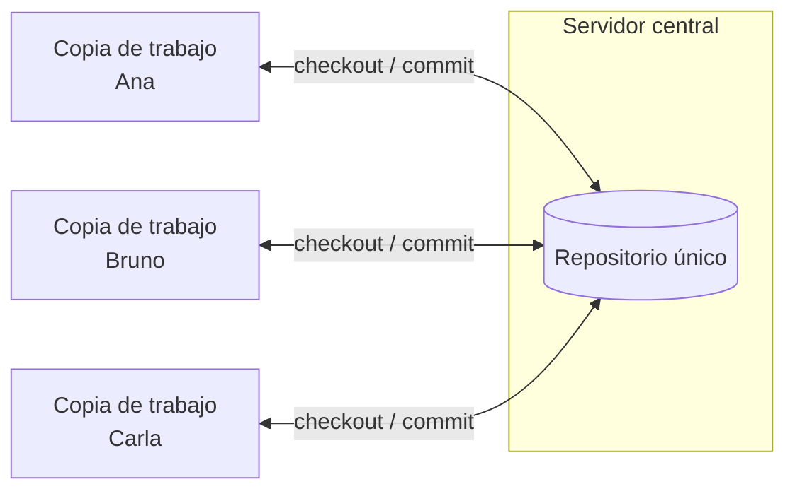
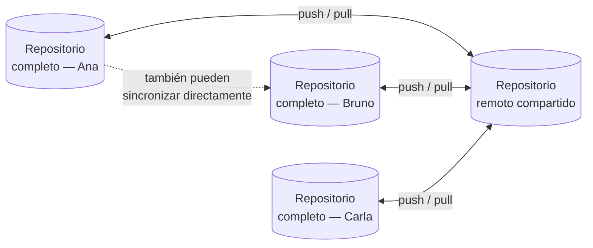
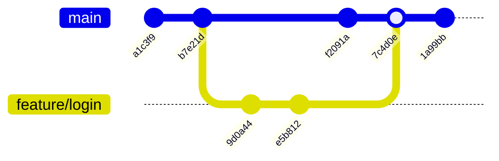
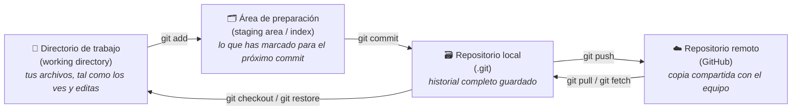
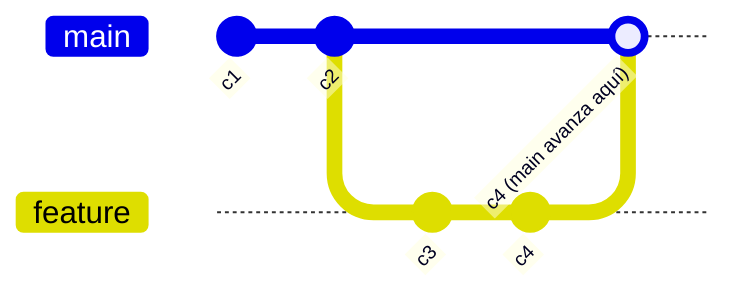
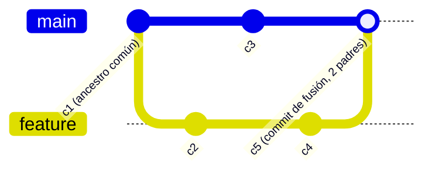
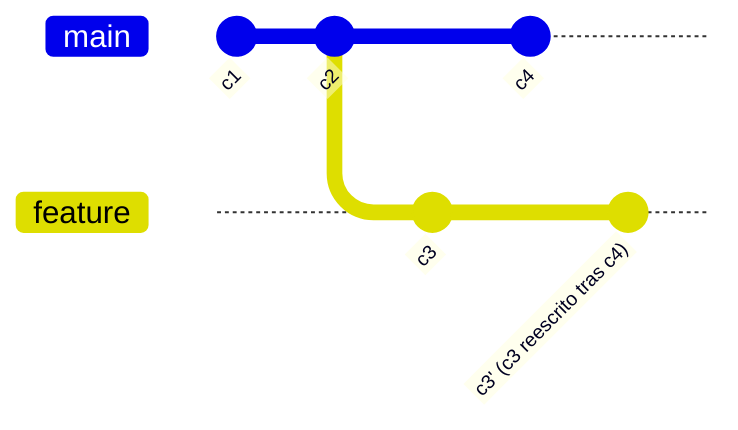
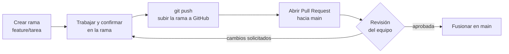
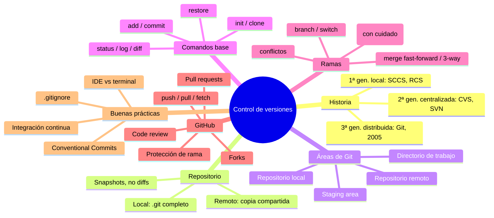

# UT1 — Control de Versiones: Git y GitHub

**Módulo:** 0487 Entornos de Desarrollo (DAW / DAM) — RD 405/2023
**Resultado de aprendizaje principal:** RA4 — *Optimiza código empleando las herramientas disponibles en el entorno de desarrollo* (criterios 4f, 4h, 4i)
**Duración orientativa:** 15 horas

> Esta unidad se imparte la primera de todas, antes que ningún otro contenido del módulo, porque el control de versiones no es "un tema más": es la herramienta con la que vas a trabajar **todos los días, en todos los módulos, durante los dos cursos**. Aprenderlo bien ahora te ahorra dolores de cabeza después.

---

## Índice

- [0. Introducción: el problema que resuelve el control de versiones](#0-introducción-el-problema-que-resuelve-el-control-de-versiones)
- [1. Historia de los sistemas de control de versiones](#1-historia-de-los-sistemas-de-control-de-versiones)
- [2. ¿Qué es un repositorio?](#2-qué-es-un-repositorio)
- [3. Git y GitHub: la herramienta y la plataforma](#3-git-y-github-la-herramienta-y-la-plataforma)
- [4. Arquitectura interna de Git](#4-arquitectura-interna-de-git)
- [5. Las áreas de trabajo de Git](#5-las-áreas-de-trabajo-de-git)
- [6. Instalación y configuración inicial](#6-instalación-y-configuración-inicial)
- [7. El flujo básico de trabajo](#7-el-flujo-básico-de-trabajo)
- [8. El archivo .gitignore: qué nunca se sube a un repositorio](#8-el-archivo-gitignore-qué-nunca-se-sube-a-un-repositorio)
- [9. Ramas: trabajar en paralelo sin pisarse](#9-ramas-trabajar-en-paralelo-sin-pisarse)
- [10. Fusión de ramas y resolución de conflictos](#10-fusión-de-ramas-y-resolución-de-conflictos)
- [11. Introducción a `rebase`](#11-introducción-a-rebase)
- [12. Repositorios remotos: trabajar con GitHub](#12-repositorios-remotos-trabajar-con-github)
- [13. Trabajo colaborativo en GitHub](#13-trabajo-colaborativo-en-github)
- [14. Mensajes de confirmación: Conventional Commits](#14-mensajes-de-confirmación-conventional-commits)
- [15. Git en el IDE frente a Git en la terminal](#15-git-en-el-ide-frente-a-git-en-la-terminal)
- [16. Introducción a la integración continua con GitHub Actions](#16-introducción-a-la-integración-continua-con-github-actions)
- [17. Caso práctico completo: el proyecto TaskFlow](#17-caso-práctico-completo-el-proyecto-taskflow)
- [18. Glosario de términos](#18-glosario-de-términos)
- [19. Síntesis y mapa de la unidad](#19-síntesis-y-mapa-de-la-unidad)
- [20. Actividades propuestas](#20-actividades-propuestas)
- [21. Fuentes bibliográficas](#21-fuentes-bibliográficas)

---

## 0. Introducción: el problema que resuelve el control de versiones

Antes de definir nada técnicamente, piensa en una situación que seguramente conoces.

Estás escribiendo un trabajo en el instituto. Guardas el archivo como `trabajo.docx`. Al día siguiente haces cambios importantes y, por si acaso, guardas una copia como `trabajo_v2.docx`. Tu compañero te manda correcciones y generas `trabajo_v2_correcciones.docx`. Justo antes de entregarlo haces un último cambio y lo llamas `trabajo_v2_correcciones_FINAL.docx`. Dos horas después descubres un error y no te queda más remedio que crear `trabajo_v2_correcciones_FINAL_definitivo.docx`.

Este escenario, que probablemente te resulta familiar, tiene un nombre técnico: **gestión de versiones mediante el nombre del archivo**. Es intuitiva, no requiere ninguna herramienta especial... y falla en cuanto el proyecto crece un poco:

- No sabes **qué cambió exactamente** entre `v2` y `v2_correcciones` sin abrir los dos archivos y compararlos a ojo.
- No sabes **quién** hizo cada cambio si trabajáis varias personas.
- Si dos personas modifican el archivo a la vez y lo suben a una carpeta compartida (Dropbox, Google Drive), aparecen ficheros como `trabajo (conflicto de Luis) v2.docx`: alguien tiene que decidir a mano qué se queda y qué se pierde.
- No hay forma sencilla de **volver atrás** a un punto concreto de hace tres semanas sin haber guardado, por suerte, esa copia exacta.
- Con código fuente el problema se agrava: un programa no son 10 páginas de texto, son cientos de archivos que dependen unos de otros. Duplicar carpetas enteras (`proyecto`, `proyecto_copia`, `proyecto_copia_funciona`) es inviable a partir de cierto tamaño.

Un **sistema de control de versiones** (VCS, *Version Control System*) es una herramienta que automatiza exactamente este problema: guarda el historial completo de cambios de un conjunto de archivos, identifica quién hizo cada cambio y cuándo, permite comparar cualquier par de versiones, volver a cualquier punto anterior, y —lo más potente— permite que varias personas trabajen **en paralelo** sobre el mismo proyecto y luego combinen (fusionen) su trabajo de forma controlada, avisando explícitamente cuando dos cambios son incompatibles entre sí.

Dicho de otro modo: un VCS convierte el "historial de cambios" en un objeto de primera clase del proyecto, con el que se puede trabajar mediante comandos, en lugar de dejarlo disperso en los nombres de archivo o en la memoria de las personas del equipo.

En este módulo usaremos **Git** como sistema de control de versiones y **GitHub** como plataforma para alojar repositorios remotos y trabajar en equipo. Son, con diferencia, el sistema y la plataforma más usados en la industria del software hoy en día, y los usarás de forma prácticamente diaria a partir de esta unidad, en Programación y en el resto de módulos del ciclo.

---

## 1. Historia de los sistemas de control de versiones

Entender por qué Git es como es —y por qué se diseñó así— ayuda mucho a entender cómo funciona. Git no apareció de la nada: es la tercera generación de una familia de herramientas que llevan resolviendo este problema desde los años 70.

### 1.1 Primera generación: control de versiones local (años 70-80)

Los primeros sistemas —**SCCS** (*Source Code Control System*, 1972, Bell Labs) y **RCS** (*Revision Control System*, 1982)— funcionaban sobre **un único ordenador**. Guardaban, para cada archivo, una base de datos local con las diferencias (*deltas*) entre versiones sucesivas. Resolvían el problema de "¿cómo vuelvo a la versión de ayer?", pero no el de "¿cómo trabajamos varias personas sobre el mismo archivo?", porque no había ningún concepto de red ni de equipo: cada programador tenía su propio historial, aislado, en su propia máquina.

### 1.2 Segunda generación: sistemas centralizados (años 90-2000)

Con la popularización de las redes locales e internet aparecieron los **sistemas centralizados**: **CVS** (*Concurrent Versions System*, 1990) y, sobre todo, **Subversion / SVN** (2000), que corrigió muchos defectos de CVS y se convirtió en el estándar de facto durante más de una década.

Su modelo es sencillo: existe **un único servidor** con el repositorio "de verdad", y cada programador tiene una copia de trabajo local que sincroniza contra ese servidor central.



Esto supuso una mejora enorme respecto a la primera generación, pero introduce dos problemas que resultarían decisivos más adelante:

- **Punto único de fallo**: si el servidor central se cae, nadie puede confirmar cambios, ni consultar el historial completo, ni siquiera saber en qué versión están los demás. Toda la historia del proyecto vive en una sola máquina.
- **Dependencia permanente de la red**: para casi cualquier operación que consulte el historial (no solo para sincronizar) hace falta conexión con el servidor.

### 1.3 Tercera generación: sistemas distribuidos (2005 en adelante)

La idea central de la tercera generación es tan simple como radical: **cada copia del repositorio es un repositorio completo**, con todo el historial, no solo con la versión actual de los archivos. No hay "el" servidor con el historial completo y copias de trabajo empobrecidas alrededor: hay muchos repositorios completos e iguales entre sí, que se sincronizan entre ellos cuando hace falta.



De este momento surgen **BitKeeper** (propietario, muy usado en el kernel Linux desde 2002), **Mercurial** y, el que nos ocupa, **Git**.

### 1.4 Por qué existe Git: el conflicto de BitKeeper y Linus Torvalds (2005)

Esta parte de la historia merece contarse con algo de detalle porque explica directamente las prioridades de diseño de Git.

Desde 2002, el desarrollo del **kernel de Linux** —uno de los proyectos de software colaborativo más grandes y complejos que existen, con miles de colaboradores en todo el mundo— se gestionaba con **BitKeeper**, un VCS distribuido propietario. La empresa que lo desarrollaba cedía licencias gratuitas a la comunidad Linux, pero en 2005 retiró esa cesión tras una disputa sobre ingeniería inversa de su protocolo.

**Linus Torvalds**, creador del kernel Linux, se encontró de la noche a la mañana sin herramienta de control de versiones para un proyecto de ese tamaño, y decidió escribir la suya propia. En unas dos semanas de trabajo intensivo escribió la primera versión de **Git** (abril de 2005). Los requisitos que se marcó, derivados directamente de la experiencia con el kernel, son la razón por la que Git funciona como funciona:

| Requisito de Torvalds                                                                          | Cómo lo resuelve Git                                                                                                                                                                       |
| ---------------------------------------------------------------------------------------------- | ------------------------------------------------------------------------------------------------------------------------------------------------------------------------------------------ |
| **Velocidad**: operar sobre miles de archivos y decenas de miles de confirmaciones sin esperas | Casi todas las operaciones (crear rama, consultar historial, comparar versiones) se ejecutan **en local**, sin red                                                                         |
| **Diseño distribuido**: sin punto único de fallo, sin depender de un servidor central          | Cada clon es un repositorio completo e independiente                                                                                                                                       |
| **Soporte robusto para desarrollo no lineal**                                                  | Ramas y fusiones baratísimas de crear, pensadas para usarse constantemente, no como excepción                                                                                              |
| **Integridad de los datos**                                                                    | Cada objeto (archivo, directorio, confirmación) se identifica por un **hash criptográfico** de su contenido: si algo se corrompe o se manipula, el hash deja de coincidir y Git lo detecta |
| **Escalar a proyectos enormes** (el kernel Linux)                                              | Modelo de datos muy simple y eficiente (ver sección 4)                                                                                                                                     |

El nombre "Git" es, según el propio Torvalds, una broma autodescriptiva: en argot británico *git* significa algo así como "persona desagradable/estúpida", y él mismo bromeó con que sigue su costumbre de ponerle a sus proyectos su propio nombre ("Linux", del ego de Linus) y esta vez el nombre encajaba con lo modesto de sus expectativas iniciales sobre el proyecto. Poco después, en 2005, el propio kernel Linux ya se gestionaba con Git, y desde entonces Git ha ido ganando terreno hasta convertirse hoy en el sistema de control de versiones dominante en la industria, muy por delante de Subversion, Mercurial o cualquier alternativa.

### 1.5 ¿Y GitHub?

Es fundamental separar dos ideas que el alumnado suele confundir al principio:

> **Git es el programa. GitHub es un servicio web que aloja repositorios Git y añade herramientas de colaboración alrededor.** Git existiría exactamente igual aunque GitHub no existiera; de hecho, existió tres años sin él.

**GitHub** se fundó en **2008** por Chris Wanstrath, PJ Hyett, Tom Preston-Werner y Scott Chacon (coautor, precisamente, del libro *Pro Git* que citamos en la bibliografía). Su idea fue tomar Git —una herramienta de línea de comandos, potente pero con una curva de aprendizaje pronunciada— y construir alrededor una plataforma web con:

- Alojamiento de repositorios remotos accesible desde cualquier lugar.
- Una interfaz visual para explorar código, historial y diferencias.
- **Pull requests**: un mecanismo (que GitHub popularizó, aunque no inventó desde cero) para proponer cambios, discutirlos y revisarlos antes de incorporarlos al proyecto principal.
- Herramientas sociales: seguir a otros desarrolladores, marcar proyectos como favoritos (*star*), issues para gestionar tareas y errores.

GitHub creció exponencialmente durante la década de 2010 hasta convertirse en el punto de encuentro por defecto del software de código abierto mundial. En **2018, Microsoft adquirió GitHub** por 7.500 millones de dólares, manteniéndolo como plataforma independiente. En 2019 GitHub lanzó **GitHub Actions**, su sistema de integración y despliegue continuos integrado directamente en la plataforma (lo veremos en la sección 16), y más recientemente ha incorporado asistencia de IA para programar (GitHub Copilot).

No es la única plataforma de este tipo: existen alternativas como **GitLab** (que además de alojar repositorios ofrece su propia solución de CI/CD muy integrada) o **Bitbucket** (de Atlassian, muy ligada a Jira y Trello). Usaremos GitHub en este módulo por ser, con diferencia, la más extendida en la industria y en el software libre, pero todo lo que aprendas sobre Git en sí (que es el 90 % del contenido de esta unidad) es exactamente igual en cualquiera de ellas.

---

## 2. ¿Qué es un repositorio?

### 2.1 Definición

Un **repositorio** (*repository*, a menudo abreviado *repo*) es el conjunto formado por:

1. Los **archivos del proyecto** en su estado actual (el código, la documentación, los recursos...).
2. **Todo el historial de cambios** de esos archivos: cada versión guardada, con su autor, su fecha, un mensaje descriptivo y una referencia a la versión anterior de la que parte.
3. Los **metadatos de gestión**: ramas existentes, etiquetas de versión, configuración del propio repositorio.

La clave que distingue un repositorio de "una carpeta con archivos" es el punto 2: un repositorio **recuerda cómo ha llegado hasta el estado actual**, paso a paso, y ese historial se puede recorrer, comparar y recuperar en cualquier momento.

### 2.2 Analogía cotidiana

Piensa en el historial de versiones de un documento de Google Docs, o en "control de cambios" de Microsoft Word: puedes ver quién escribió cada párrafo, comparar la versión de ayer con la de hoy, y restaurar una versión anterior si algo sale mal. Un repositorio Git es exactamente esa idea, pero aplicada a **todos los archivos de un proyecto entero a la vez**, con la capacidad añadida de que varias personas puedan generar versiones en paralelo (no una detrás de otra) y combinarlas después de forma controlada.

Otra analogía útil es la del **libro de actas** de una comunidad de vecinos o de una asociación: cada reunión (cada *commit*) queda registrada con su fecha, quién la convocó y qué se acordó; el libro completo, leído de principio a fin, reconstruye toda la historia de la comunidad, y en cualquier momento se puede "ir a la página" de una fecha concreta para ver cómo estaban las cosas entonces.

### 2.3 Repositorio local vs. repositorio remoto

Esta distinción es una de las más importantes de toda la unidad porque **se malinterpreta con mucha frecuencia**:

- **Repositorio local**: vive en tu propio ordenador, dentro de una carpeta oculta llamada `.git` en la raíz de tu proyecto. Contiene el historial completo. Puedes hacer confirmaciones (*commits*), crear ramas, consultar el historial, comparar versiones... **sin conexión a internet**, porque todo está ahí, en tu disco.
- **Repositorio remoto**: es una copia del repositorio alojada en un servidor (típicamente GitHub), que sirve como punto de encuentro para que varias personas —o varios equipos, o vosotros mismos desde varios ordenadores— sincronicen su trabajo.

Un error de principiante muy habitual es pensar que "hacer *commit*" ya sube los cambios a GitHub. **No es así**: un *commit* es una operación puramente local; sólo cuando ejecutas `git push` esos cambios viajan al repositorio remoto. Volveremos sobre esto con detalle en la sección 5.

### 2.4 Qué guarda Git exactamente: instantáneas, no diferencias

Aquí hay un matiz técnico importante que distingue a Git de la mayoría de VCS anteriores (incluidos CVS y Subversion). La intuición habitual es pensar que un VCS guarda, para cada versión, **la diferencia** respecto a la versión anterior (un "parche"): así lo hacían los sistemas de primera y segunda generación.

Git, en cambio, guarda en cada confirmación una **instantánea (snapshot) completa** del estado de todos los archivos del proyecto en ese momento. Si un archivo no ha cambiado entre dos confirmaciones, Git no vuelve a guardarlo: simplemente enlaza esa confirmación con la copia idéntica ya almacenada anteriormente (mediante su hash, ver sección 4). El resultado práctico es muy similar a guardar diferencias en cuanto al espacio en disco, pero conceptualmente Git piensa "estado completo del proyecto en el instante X", no "qué líneas cambiaron"; esto simplifica enormemente operaciones que en otros sistemas eran costosas, como cambiar de rama o comparar dos puntos cualesquiera del historial.

---

## 3. Git y GitHub: la herramienta y la plataforma

Antes de entrar en profundidad en cómo funciona Git por dentro, conviene fijar con una tabla la distinción de la sección 1.5, porque es la base de todo lo que viene después:

|                     | **Git**                                                          | **GitHub**                                                                          |
| ------------------- | ---------------------------------------------------------------- | ----------------------------------------------------------------------------------- |
| ¿Qué es?            | Software de control de versiones distribuido                     | Plataforma web (servicio en la nube)                                                |
| ¿Dónde se ejecuta?  | En tu propio ordenador (línea de comandos o integrado en el IDE) | En los servidores de Microsoft/GitHub                                               |
| ¿Necesita internet? | No, para el trabajo local                                        | Sí, para alojar y compartir repositorios remotos                                    |
| ¿Quién lo creó?     | Linus Torvalds (2005)                                            | Wanstrath, Hyett, Preston-Werner y Chacon (2008)                                    |
| ¿Es imprescindible? | Sí, es la herramienta de control de versiones en sí              | No: podrías usar Git sin ninguna plataforma web, o con GitLab/Bitbucket en su lugar |
| Conceptos propios   | Repositorio, commit, rama, *merge*, *staging area*               | *Pull request*, *issue*, *fork*, *Actions*, *star*                                  |

Una forma de recordarlo que funciona bien: **si el concepto tiene equivalente en la terminal con el comando `git ...`, es de Git; si sólo existe como botón o página web, es de GitHub.**

---

## 4. Arquitectura interna de Git

Esta sección explica **por qué** los comandos de Git funcionan como funcionan. No es imprescindible memorizarla para usar Git en el día a día, pero entenderla evita muchísima confusión más adelante (especialmente con ramas, `merge` y `rebase`), porque convierte comandos que parecen "magia" en operaciones muy simples sobre una estructura de datos concreta.

### 4.1 Los cuatro tipos de objetos

Internamente, un repositorio Git es una base de datos de **objetos**, cada uno identificado por el hash SHA (una cadena de 40 caracteres hexadecimales en el formato clásico, o 64 con el más reciente SHA-256) del propio contenido del objeto. Hay cuatro tipos:

| Objeto                           | Qué contiene                                                                                                                                                        |
| -------------------------------- | ------------------------------------------------------------------------------------------------------------------------------------------------------------------- |
| **blob** (*binary large object*) | El contenido de un archivo, tal cual, sin nombre ni metadatos                                                                                                       |
| **tree**                         | Un "directorio": una lista de entradas (nombre, tipo, hash) que apunta a *blobs* (archivos) y a otros *trees* (subdirectorios)                                      |
| **commit**                       | Una confirmación: apunta a un *tree* (el estado completo del proyecto en ese momento), a su autor, fecha, mensaje, y a la confirmación (o confirmaciones) **padre** |
| **tag**                          | Una etiqueta con nombre que apunta a un *commit* concreto, típicamente usada para marcar versiones publicadas (`v1.0.0`)                                            |

Fíjate en el dato clave: **un commit no guarda "qué cambió"**; guarda un puntero al árbol completo del proyecto en ese instante, más un puntero al commit anterior. El historial completo es, por tanto, una cadena (más exactamente, un grafo) de confirmaciones enlazadas por esos punteros.

### 4.2 El grafo de confirmaciones (DAG)

Cada *commit* apunta a su padre (o padres, si es una fusión de dos ramas). El resultado es un **grafo acíclico dirigido** (DAG): acíclico porque nunca se puede volver a un commit anterior formando un círculo, dirigido porque cada flecha va siempre "hacia atrás" en el tiempo.



Sobre este grafo, dos conceptos son la base de todo lo demás:

- **HEAD**: un puntero especial que indica "dónde estás mirando ahora mismo" (normalmente, la última confirmación de la rama en la que estás trabajando).
- **Rama (branch)**: es, técnicamente, **solo un puntero con nombre** a un commit concreto (al último de esa línea de trabajo). No es una copia de archivos ni una carpeta paralela: es una etiqueta que se mueve automáticamente hacia adelante cada vez que confirmas un cambio estando situado en ella. Esto explica por qué en Git crear una rama es una operación instantánea y casi gratuita (crear un puntero cuesta nada), a diferencia de otros sistemas donde ramificar implicaba copiar archivos.

### 4.3 Integridad mediante hashes

Como cada objeto se identifica por el hash de su propio contenido, **es imposible modificar cualquier archivo, commit o metadato antiguo sin que cambie su hash** y, en cascada, el de todos los commits posteriores que lo referencian. Esto es lo que Torvalds pedía como "integridad de los datos": Git detecta automáticamente cualquier corrupción o manipulación del historial, porque los hashes dejarían de coincidir.

---

## 5. Las áreas de trabajo de Git

Este es, con diferencia, el concepto **más importante** de toda la unidad para entender el flujo diario de trabajo. Git no mueve los cambios directamente de "tus archivos" al "historial guardado": los hace pasar por **tres áreas locales** y, cuando corresponde, una cuarta área remota.



### 5.1 Directorio de trabajo (*working directory*)

Es la carpeta real de tu proyecto, la que ves en el explorador de archivos o en el IDE. Aquí es donde editas código, creas archivos, los borras... Git observa constantemente esta carpeta y clasifica cada archivo en una de estas categorías:

- **Sin seguimiento** (*untracked*): un archivo nuevo que Git todavía no conoce.
- **Modificado** (*modified*): un archivo que Git ya conocía y que ha cambiado desde la última confirmación.
- **Sin cambios** (*unmodified*): idéntico a como estaba en la última confirmación.

### 5.2 Área de preparación (*staging area* / *index*)

Esta es la pieza que más sorprende a quien viene de otros sistemas (o de "guardar como") y la que da a Git su flexibilidad característica. La *staging area* es un **borrador del próximo commit**: una lista de cambios que has decidido explícitamente que quieres incluir en la siguiente confirmación, aunque en el directorio de trabajo haya *otros* cambios que todavía no quieres confirmar.

**Analogía cotidiana:** imagina que estás preparando una maleta (el commit) para un viaje. Tu habitación entera (el directorio de trabajo) tiene mucha ropa, pero solo metes en la maleta (`git add`) las prendas que vienen en este viaje concreto. El resto se queda en la habitación para otro momento. Cerrar la maleta y facturarla es el `git commit`.

Esto permite, por ejemplo, corregir dos errores distintos en el mismo archivo y confirmarlos **por separado**, en dos commits con mensajes distintos y bien enfocados (`git add -p` permite incluso seleccionar fragmentos concretos de un archivo, línea a línea).

### 5.3 Repositorio local (`.git`)

Cuando confirmas (`git commit`), el contenido de la *staging area* se convierte en un nuevo objeto *commit* permanente dentro de la carpeta oculta `.git`, que es, en sí misma, la base de datos completa del repositorio (todos los objetos, todas las ramas, toda la configuración). Es importante remarcar: **este paso no requiere conexión a internet ni contacto con GitHub**. Puedes hacer decenas de commits en un vuelo sin wifi.

### 5.4 Repositorio remoto

Es una copia del repositorio `.git` alojada en un servidor (GitHub). `git push` envía tus commits locales que el remoto todavía no tiene; `git pull` (que en realidad combina `git fetch` + `git merge`, ver sección 12) trae los commits que otras personas han subido y que tú todavía no tienes.

### 5.5 Tabla resumen: comando → área que afecta

| Comando                        | Qué hace                                                  | Áreas involucradas                        |
| ------------------------------ | --------------------------------------------------------- | ----------------------------------------- |
| `git add archivo`              | Marca cambios para el próximo commit                      | Directorio de trabajo → Staging           |
| `git commit`                   | Crea una confirmación permanente                          | Staging → Repositorio local               |
| `git push`                     | Sube confirmaciones al remoto                             | Repositorio local → Repositorio remoto    |
| `git pull` / `git fetch`       | Trae confirmaciones del remoto                            | Repositorio remoto → Repositorio local    |
| `git restore --staged archivo` | Saca un archivo de la staging area (sin perder el cambio) | Staging → Directorio de trabajo           |
| `git restore archivo`          | Descarta cambios no confirmados en un archivo             | Repositorio local → Directorio de trabajo |

---

## 6. Instalación y configuración inicial

Git se instala una sola vez por ordenador (en los equipos del aula-taller ya viene instalado; en un equipo personal, se descarga desde [git-scm.com](https://git-scm.com/downloads) para Windows/macOS/Linux, o mediante el gestor de paquetes del sistema en Linux, p. ej. `sudo apt install git`).

Tras instalarlo, la configuración mínima obligatoria es indicar quién eres, porque **cada commit queda firmado con esta identidad**:

```bash
git config --global user.name "Ana García"
git config --global user.email "ana.garcia@correo.com"
```

`--global` indica que esta configuración se aplica a todos los repositorios de tu usuario en ese ordenador (existe también configuración por repositorio, sin `--global`, útil si usas un correo distinto para proyectos personales y del centro). Otras configuraciones habituales:

```bash
git config --global init.defaultBranch main      # nombre de la rama principal por defecto
git config --global core.editor "code --wait"    # editor para mensajes de commit largos
git config --list                                # ver toda la configuración activa
```

---

## 7. El flujo básico de trabajo

### 7.1 Crear o obtener un repositorio: `init` vs `clone`

Hay dos formas de empezar a trabajar con un repositorio:

- **`git init`**: convierte una carpeta ya existente (o vacía) en un repositorio Git nuevo, creando la subcarpeta `.git`. Se usa cuando **empiezas un proyecto desde cero**.
- **`git clone <url>`**: descarga una **copia completa** de un repositorio remoto que ya existe (por ejemplo, en GitHub), incluyendo todo su historial, y la configura automáticamente para que sepa de dónde viene (el remoto llamado `origin`). Se usa cuando te **incorporas a un proyecto existente**.

```bash
git init                                  # nuevo repositorio en la carpeta actual
git clone https://github.com/usuario/proyecto.git   # copia completa de un repositorio remoto
```

### 7.2 Consultar el estado: `status` y `log`

```bash
git status
```

Es, con diferencia, el comando que más vas a teclear. Te dice en qué rama estás, qué archivos están modificados, cuáles están en la *staging area* y cuáles sin seguimiento todavía. Es la forma de no perderte nunca.

```bash
git log                     # historial completo de commits (autor, fecha, mensaje)
git log --oneline           # una línea por commit, más legible
git log --oneline --graph --all   # además, dibuja el grafo de ramas en ASCII
```

### 7.3 Confirmar cambios: `add` y `commit`

```bash
git add archivo.java              # añade un archivo concreto a la staging area
git add .                         # añade todos los cambios de la carpeta actual
git commit -m "Añade validación del formulario de login"
```

El mensaje de `commit` (`-m`) no es opcional en la práctica: es la documentación más importante del proyecto, la que explica el **porqué** de cada cambio (volveremos sobre cómo escribir buenos mensajes en la sección 14).

### 7.4 Ver diferencias: `diff`

```bash
git diff                 # diferencias entre el directorio de trabajo y la staging area
git diff --staged        # diferencias entre la staging area y el último commit
git diff HEAD~1 HEAD     # diferencias entre los dos últimos commits
```

### 7.5 Deshacer cambios: `restore`

```bash
git restore archivo.java             # descarta cambios no confirmados en el directorio de trabajo
git restore --staged archivo.java    # saca un archivo de la staging area, sin perder el cambio
```

> ⚠️ `git restore archivo.java` **descarta el cambio de verdad, sin posibilidad de recuperarlo** (a menos que ya estuviera confirmado en algún commit anterior). Es el equivalente a "deshacer" de forma permanente: úsalo con cuidado.

---

## 8. El archivo `.gitignore`: qué nunca se sube a un repositorio

No todos los archivos de una carpeta de proyecto deben formar parte del repositorio. El archivo `.gitignore`, en la raíz del proyecto, le indica a Git qué archivos o patrones **ignorar por completo** (ni siquiera aparecerán como "sin seguimiento" en `git status`).

```gitignore
# Compilados y artefactos de construcción
target/
*.class
*.jar

# Configuración específica del IDE
.idea/
*.iml

# Archivos del sistema operativo
.DS_Store
Thumbs.db

# Credenciales y configuración local sensible
.env
application-local.properties
```

¿Por qué es tan importante? Tres razones, de mayor a menor gravedad:

1. **Nunca se suben secretos**: contraseñas, claves de API, tokens de acceso, certificados privados. Un repositorio Git conserva **todo su historial para siempre**: aunque borres un secreto en el commit siguiente, seguirá existiendo en el historial y cualquiera con acceso al repositorio (y en un repositorio público, cualquier persona del mundo) podrá recuperarlo. La única forma correcta de gestionar credenciales es que ni siquiera lleguen a confirmarse: variables de entorno, gestores de secretos, archivos de configuración local excluidos por `.gitignore`.
2. **No se suben artefactos generados** (compilados `.class`, `.jar`, carpetas `target/`, `node_modules/`...): se regeneran automáticamente a partir del código fuente, ocupan mucho espacio y generan conflictos de fusión sin ningún valor (dos compilaciones del mismo código en máquinas distintas casi nunca son binariamente idénticas).
3. **No se sube configuración personal del entorno** (carpeta `.idea/` de IntelliJ, `.vscode/` con preferencias particulares): lo que le sirve a tu editor en tu máquina no tiene por qué imponerse al resto del equipo.

Existen plantillas de `.gitignore` ya preparadas por lenguaje/framework (por ejemplo, en [github.com/github/gitignore](https://github.com/github/gitignore)); IntelliJ IDEA, además, puede generar automáticamente el `.gitignore` adecuado al crear un proyecto Maven.

---

## 9. Ramas: trabajar en paralelo sin pisarse

### 9.1 Qué es una rama y para qué sirve

Como vimos en la sección 4.2, una rama es simplemente un puntero con nombre a un commit. Su utilidad práctica es enorme: te permite **aislar una línea de trabajo** (una funcionalidad nueva, una corrección de un error, un experimento) del resto del proyecto, de modo que:

- Puedes confirmar cambios intermedios, incompletos o experimentales sin afectar al código que ya funciona.
- Varias personas pueden trabajar en paralelo sobre partes distintas del mismo proyecto sin interferirse.
- Si el experimento no funciona, basta con descartar la rama: el resto del proyecto nunca se vio afectado.

Todo repositorio nace con una rama por defecto, habitualmente llamada `main` (antes, por convención histórica que se está abandonando, `master`), que representa la línea de trabajo estable/principal del proyecto.

### 9.2 Comandos básicos

```bash
git branch                        # lista las ramas locales (marca con * la actual)
git branch feature/listado-tareas # crea una rama nueva, sin cambiar a ella
git switch feature/listado-tareas # cambia a esa rama
git switch -c feature/listado-tareas   # crea la rama Y cambia a ella en un solo paso
git branch -d feature/listado-tareas   # borra una rama ya fusionada
```

> `git switch` es el comando moderno y recomendado para cambiar de rama. Todavía es muy habitual encontrar `git checkout nombre-rama` en documentación y proyectos antiguos: hace lo mismo, pero `checkout` es un comando "todoterreno" que también sirve para restaurar archivos, lo cual generaba ambigüedad; `switch` (y `restore`, sección 7.5) nacieron para separar claramente ambas responsabilidades.

### 9.3 Convención de nombres

Es buena práctica nombrar las ramas de forma que se entienda su propósito de un vistazo, típicamente con un prefijo:

| Prefijo        | Uso                                                      |
| -------------- | -------------------------------------------------------- |
| `feature/...`  | Una funcionalidad nueva (`feature/login-usuario`)        |
| `fix/...`      | Corrección de un error (`fix/error-calculo-total`)       |
| `docs/...`     | Cambios solo de documentación                            |
| `refactor/...` | Reestructuración de código sin cambiar su comportamiento |

---

## 10. Fusión de ramas y resolución de conflictos

### 10.1 `git merge`: incorporar el trabajo de una rama en otra

Cuando el trabajo de una rama está terminado, se **fusiona** de vuelta en la rama principal:

```bash
git switch main
git merge feature/listado-tareas
```

Existen dos tipos de fusión, y entenderlos exige recordar que una rama es solo un puntero (sección 4.2):

**Fusión "fast-forward" (avance rápido).** Ocurre cuando `main` no ha recibido ningún commit nuevo desde que se creó la rama `feature`: no hay nada que combinar, así que Git simplemente **mueve el puntero de `main`** hasta el último commit de `feature`. No se crea ningún commit nuevo de fusión.



**Fusión de tres vías (3-way merge).** Ocurre cuando **ambas** ramas han recibido commits nuevos desde que se separaron. Git localiza el ancestro común más reciente de las dos ramas y combina los cambios de ambas en un **nuevo commit de fusión**, que tiene **dos padres** (uno de cada rama).



### 10.2 Conflictos de fusión

Git combina automáticamente los cambios de ambas ramas **línea a línea**, y lo consigue en la gran mayoría de los casos sin ninguna intervención. Un **conflicto** aparece únicamente cuando **las dos ramas han modificado las mismas líneas del mismo archivo de forma distinta**: en ese caso, Git no puede decidir por sí solo cuál de las dos versiones es la correcta, y detiene la fusión pidiendo que una persona lo resuelva.

Git marca el conflicto directamente dentro del archivo afectado, con estas marcas:

```java
<<<<<<< HEAD
int descuento = precio * 0.10;
=======
int descuento = precio * 0.15;
>>>>>>> feature/descuentos
```

Todo lo que hay entre `<<<<<<< HEAD` y `=======` es la versión de la rama en la que estabas (`main`, señalada por `HEAD`); todo lo que hay entre `=======` y `>>>>>>> feature/descuentos` es la versión de la rama que se está fusionando. Resolver el conflicto consiste en editar el archivo dejando el código correcto (que puede ser una de las dos versiones, una combinación de ambas, o algo distinto), eliminar las marcas `<<<<<<<`, `=======` y `>>>>>>>`, y confirmar la resolución:

```bash
git add archivo-conflictivo.java
git commit
```

Un conflicto de fusión **no es un error ni un fallo de Git**: es Git funcionando exactamente como debe, pidiendo una decisión humana en el único punto donde una máquina no puede decidir con seguridad.

---

## 11. Introducción a `rebase`

`git rebase` es una alternativa a `git merge` para incorporar cambios, con un objetivo distinto: en lugar de crear un commit de fusión con dos padres, **reescribe** los commits de una rama para que parezca que se crearon a partir del último commit de otra rama, produciendo un historial **lineal**, sin bifurcaciones visibles.

```bash
git switch feature/listado-tareas
git rebase main
```



La regla práctica más importante para empezar (se ampliará en unidades posteriores con `rebase` interactivo) es: **nunca hagas `rebase` de una rama que ya has compartido con otras personas (ya subida con `push` y que otros puedan haber descargado)**, porque reescribe el historial y descoloca a quien ya tenía la versión anterior de esos commits. `rebase` es seguro y muy útil sobre ramas **locales y personales**, antes de compartirlas; `merge` es la opción segura por defecto para incorporar trabajo ya compartido.

---

## 12. Repositorios remotos: trabajar con GitHub

### 12.1 Conectar un repositorio local con uno remoto

```bash
git remote add origin https://github.com/usuario/proyecto.git   # vincula un remoto llamado "origin"
git remote -v                                                     # lista los remotos configurados
```

`origin` es solo un alias por convención (podría llamarse de cualquier otra forma): es el nombre que Git asigna automáticamente al remoto del que clonaste un repositorio, y el que se usa por costumbre para el remoto "principal" de un proyecto.

### 12.2 `push`, `pull` y `fetch`

```bash
git push origin main          # sube los commits locales de "main" al remoto "origin"
git pull origin main          # trae y fusiona los commits nuevos del remoto
git fetch origin              # solo trae los commits nuevos, sin fusionarlos todavía
```

La diferencia entre `pull` y `fetch` genera muchas dudas al principio y merece una tabla propia:

|                                                 | `git fetch`                                                                        | `git pull`                                                                     |
| ----------------------------------------------- | ---------------------------------------------------------------------------------- | ------------------------------------------------------------------------------ |
| ¿Descarga los commits nuevos del remoto?        | Sí                                                                                 | Sí                                                                             |
| ¿Los fusiona automáticamente en tu rama actual? | **No**                                                                             | **Sí** (equivale a `fetch` + `merge`)                                          |
| ¿Cuándo usarlo?                                 | Cuando quieres **ver** qué ha cambiado en el remoto antes de decidir si fusionarlo | Cuando confías en incorporar directamente los cambios remotos a tu copia local |

`git fetch` es la opción más prudente cuando se está aprendiendo: te permite inspeccionar (`git log origin/main`, `git diff main origin/main`) qué ha cambiado antes de mezclarlo con tu propio trabajo.

---

## 13. Trabajo colaborativo en GitHub

### 13.1 El flujo de ramas por tarea (*feature branch workflow*)

El patrón de trabajo en equipo más habitual, y el que seguiremos en las prácticas colaborativas de esta unidad, es:

1. Nadie confirma directamente sobre `main`.
2. Para cada tarea (una funcionalidad, una corrección) se crea una **rama nueva** a partir de `main`.
3. Se trabaja y se confirma en esa rama, subiéndola al remoto (`git push origin feature/mi-tarea`).
4. Cuando la tarea está terminada, se abre una **pull request** hacia `main`.
5. Otra persona del equipo **revisa** los cambios propuestos.
6. Si se aprueba, se fusiona en `main`; si no, se piden cambios y se repite el ciclo.



### 13.2 ¿Qué es una *pull request*?

Una **pull request** (PR, "solicitud de extracción") es una propuesta formal de incorporar los commits de una rama a otra (normalmente, de una rama de tarea a `main`), abierta en GitHub como una página web que muestra:

- Todos los archivos modificados, con las diferencias línea a línea coloreadas.
- Un espacio de discusión donde el equipo puede comentar líneas concretas de código.
- El estado de las comprobaciones automáticas (si hay integración continua configurada, sección 16).
- Un botón para fusionar, una vez aprobada.

El nombre "pull request" viene precisamente de pedirle a quien mantiene `main` que "extraiga" (*pull*) tus cambios hacia el proyecto principal. No es un comando de Git: es un concepto exclusivo de plataformas como GitHub (en GitLab, la misma idea se llama *merge request*), construido **encima** de las ramas de Git.

### 13.3 Revisión de código entre iguales (*code review*)

La revisión de código no es un trámite burocrático: es el punto donde una segunda persona, que no ha estado inmersa en el problema, comprueba que el código es correcto, legible y coherente con el resto del proyecto, **antes** de que se integre. En esta unidad practicaréis revisión entre iguales: cada pull request de un compañero o compañera deberá recibir al menos un comentario o aprobación de otra persona del equipo antes de fusionarse.

### 13.4 Protección de la rama principal

GitHub permite configurar **reglas de protección** sobre `main` (*branch protection rules*) que, por ejemplo:

- Impiden subir commits directamente a `main`: todo cambio debe pasar por una pull request.
- Exigen al menos una aprobación de otra persona antes de poder fusionar.
- Exigen que las comprobaciones automáticas (CI) pasen en verde antes de poder fusionar.

Esto convierte en obligatorias, a nivel de la propia plataforma, las buenas prácticas de las secciones 13.1-13.3: no dependen de la buena voluntad del equipo, están garantizadas técnicamente.

### 13.5 *Forks*: contribuir sin permiso de escritura

Cuando quieres contribuir a un proyecto sobre el que **no** tienes permiso de escritura (típicamente, un proyecto de código abierto de otra persona u organización), el mecanismo no es una rama, sino un **fork**: una copia completa del repositorio bajo tu propia cuenta de GitHub, sobre la que sí tienes control total. Trabajas en tu fork, y cuando quieres proponer tus cambios al proyecto original abres una pull request **desde tu fork hacia el repositorio original**. Es la misma idea que una rama de tarea, un nivel por encima: en vez de "una rama dentro del mismo repositorio", es "una copia entera del repositorio, bajo tu cuenta".

---

## 14. Mensajes de confirmación: Conventional Commits

### 14.1 Por qué importa un buen mensaje

El mensaje de un commit es, junto con el propio código, la documentación más consultada de un proyecto: `git log`, `git blame` (quién y cuándo introdujo cada línea) y las pull requests dependen de mensajes claros para que el historial sea útil. Un historial lleno de mensajes como `cambios`, `arreglo`, `asdf` o `commit final` es, a efectos prácticos, un historial sin documentar.

### 14.2 El formato Conventional Commits

**Conventional Commits** es una convención (no una imposición de Git, sino un estándar de la comunidad, ampliamente adoptado) para estructurar el mensaje de cada commit de forma uniforme y, además, procesable automáticamente (por ejemplo, para generar un registro de cambios o decidir el número de versión siguiente):

```
<tipo>[ámbito opcional]: <descripción breve en presente>

[cuerpo opcional, explicando el porqué, no el qué]

[pie opcional, p. ej. referencias a incidencias]
```

| Tipo       | Se usa para                                                                                  |
| ---------- | -------------------------------------------------------------------------------------------- |
| `feat`     | Una funcionalidad nueva                                                                      |
| `fix`      | Una corrección de error                                                                      |
| `docs`     | Cambios solo en documentación                                                                |
| `refactor` | Reestructuración de código sin cambiar su comportamiento externo                             |
| `test`     | Añadir o corregir pruebas                                                                    |
| `chore`    | Tareas de mantenimiento (dependencias, configuración) sin afectar al código de la aplicación |

**Ejemplos:**

```
feat(login): añade validación de formato al campo de correo

fix(carrito): corrige el cálculo del total cuando hay descuentos acumulados

El total se calculaba aplicando los descuentos sobre el precio
original repetidamente en lugar de sobre el precio ya descontado.

docs(readme): añade instrucciones de instalación para Linux
```

Comparado con `arreglo bug` o `cambios varios`, el beneficio es evidente: cualquiera que lea el historial dentro de seis meses entiende, sin abrir el código, qué cambió y por qué.

---

## 15. Git en el IDE frente a Git en la terminal

IntelliJ IDEA (y prácticamente cualquier IDE moderno) integra Git en su interfaz: puedes ver el estado de los archivos con colores, hacer *commit* y *push* desde un panel, comparar versiones con un visor de diferencias gráfico, e incluso confirmar solo fragmentos concretos de un archivo (*staging* por *hunks*) con un par de clics.

|                                  | Terminal                                                                                                                       | IDE integrado                                                                                                 |
| -------------------------------- | ------------------------------------------------------------------------------------------------------------------------------ | ------------------------------------------------------------------------------------------------------------- |
| Curva de aprendizaje             | Exige conocer los comandos exactos                                                                                             | Más intuitivo a primera vista (botones, menús)                                                                |
| Qué se entiende de lo que ocurre | Todo lo que pasa es explícito: ves exactamente qué comando ejecutas                                                            | Algunas operaciones (p. ej. resolver un conflicto) se simplifican, pero puede ocultar qué ocurre "por debajo" |
| Portabilidad                     | Los mismos comandos funcionan en cualquier sistema operativo, servidor sin interfaz gráfica, script de integración continua... | Depende del IDE concreto                                                                                      |
| Comparación visual de cambios    | Requiere herramientas externas o `git diff` en texto                                                                           | Muy cómoda, con colores y navegación línea a línea                                                            |
| Automatización (scripts, CI)     | Imprescindible: todo pipeline de integración continua ejecuta comandos Git                                                     | No aplica                                                                                                     |

**Recomendación pedagógica de esta unidad**: aprenderéis primero los comandos en terminal, porque son los que funcionan en cualquier contexto (incluida la integración continua de la sección 16) y porque obligan a entender realmente qué área de trabajo se ve afectada por cada operación. Una vez consolidados los conceptos, usar el panel de Git de IntelliJ IDEA en el día a día es perfectamente razonable y ahorra tiempo: la herramienta no sustituye la comprensión, la agiliza.

---

## 16. Introducción a la integración continua con GitHub Actions

### 16.1 Qué es la integración continua

La **integración continua** (CI, *Continuous Integration*) es la práctica de ejecutar automáticamente, en cada cambio subido al repositorio, un conjunto de comprobaciones (típicamente: que el proyecto compila y que las pruebas automáticas pasan) **antes** de que ese cambio se dé por bueno. En esta unidad veremos solo lo mínimo indispensable para entender el concepto; se completará con el análisis de calidad de código en las unidades UT6 y UT7, una vez sepáis diseñar pruebas.

### 16.2 GitHub Actions: estructura mínima

**GitHub Actions** ejecuta automáticamente flujos de trabajo (*workflows*) definidos en archivos YAML dentro de la carpeta `.github/workflows/` del repositorio, en respuesta a eventos como un `push` o la apertura de una pull request.

```yaml
# .github/workflows/build.yml
name: Construcción y pruebas

on:
  push:
    branches: [main]
  pull_request:
    branches: [main]

jobs:
  build:
    runs-on: ubuntu-latest
    steps:
      - uses: actions/checkout@v4          # descarga el repositorio en la máquina del workflow
      - uses: actions/setup-java@v4
        with:
          java-version: '21'
          distribution: 'temurin'
      - name: Construir con Maven
        run: mvn -B verify                 # compila y ejecuta las pruebas del proyecto
```

Con esto, cada vez que alguien haga `push` o abra una pull request, GitHub compilará el proyecto y ejecutará sus pruebas automáticamente en un servidor propio, y mostrará el resultado (✅ o ❌) directamente en la pull request, sin que nadie tenga que ejecutarlo manualmente. Combinado con la protección de rama de la sección 13.4 ("exigir que las comprobaciones pasen antes de fusionar"), esto hace que sea **técnicamente imposible** incorporar a `main` un cambio que rompa la compilación o las pruebas existentes.

---

## 17. Caso práctico completo: el proyecto TaskFlow

Vamos a recorrer, de principio a fin, el ciclo de vida completo de una pequeña funcionalidad, uniendo todo lo visto en la unidad. Supongamos un proyecto Java sencillo, **TaskFlow**, un gestor de tareas de consola, ya iniciado por el equipo.

**Paso 1 — Empezar desde el repositorio existente**

```bash
git clone https://github.com/instituto-ana-luisa/taskflow.git
cd taskflow
```

**Paso 2 — Crear una rama para la nueva tarea**

```bash
git switch -c feature/listado-tareas-pendientes
```

**Paso 3 — Trabajar y confirmar en pasos pequeños y con sentido**

```bash
# ... se edita ListadoTareas.java ...
git add src/main/java/taskflow/ListadoTareas.java
git commit -m "feat(listado): añade el filtrado de tareas pendientes"

# ... se edita ListadoTareasTest.java ...
git add src/test/java/taskflow/ListadoTareasTest.java
git commit -m "test(listado): añade pruebas del filtrado de tareas pendientes"
```

**Paso 4 — Comprobar que no queda nada por confirmar y subir la rama**

```bash
git status
git push origin feature/listado-tareas-pendientes
```

**Paso 5 — Abrir una pull request en GitHub**

Desde la página del repositorio en GitHub, se abre una pull request de `feature/listado-tareas-pendientes` hacia `main`, con una descripción de qué se ha hecho y por qué.

**Paso 6 — Revisión entre iguales**

Un compañero revisa el código, deja un comentario en una línea concreta sugiriendo un cambio de nombre de variable. Se corrige, se confirma un nuevo commit en la misma rama, y se sube de nuevo (`git push`): la pull request se actualiza automáticamente con el nuevo commit.

**Paso 7 — Comprobaciones automáticas**

GitHub Actions ejecuta el workflow de construcción (sección 16): compila el proyecto y ejecuta todas las pruebas, incluidas las nuevas. Aparece ✅ en la pull request.

**Paso 8 — Fusión**

Con la aprobación y las comprobaciones en verde (exigidas por la protección de rama), se fusiona la pull request en `main` desde la propia interfaz de GitHub.

**Paso 9 — Actualizar el repositorio local**

```bash
git switch main
git pull origin main
git branch -d feature/listado-tareas-pendientes   # la rama ya cumplió su función
```

Este ciclo —rama, commits pequeños y bien documentados, pull request, revisión, comprobaciones automáticas, fusión— es, en esencia, el flujo de trabajo real que se usa hoy en la inmensa mayoría de equipos de desarrollo profesional, y es exactamente el que practicaréis en las actividades colaborativas de esta unidad.

---

## 18. Glosario de términos

| Término (ES)                         | Término (EN)                  | Definición breve                                                                           |
| ------------------------------------ | ----------------------------- | ------------------------------------------------------------------------------------------ |
| Repositorio                          | *Repository*                  | Proyecto más todo su historial de cambios                                                  |
| Confirmación                         | *Commit*                      | Instantánea guardada de forma permanente en el historial                                   |
| Rama                                 | *Branch*                      | Puntero con nombre a una línea de desarrollo                                               |
| Área de preparación                  | *Staging area* / *index*      | Borrador del próximo commit                                                                |
| Directorio de trabajo                | *Working directory*           | Los archivos del proyecto tal como los editas                                              |
| Fusión                               | *Merge*                       | Incorporar los cambios de una rama en otra                                                 |
| Conflicto de fusión                  | *Merge conflict*              | Cambios incompatibles que requieren decisión humana                                        |
| Solicitud de extracción              | *Pull request*                | Propuesta de incorporar los cambios de una rama a otra, con discusión y revisión           |
| Bifurcación (copia bajo otra cuenta) | *Fork*                        | Copia completa de un repositorio ajeno, bajo control propio                                |
| Forja                                | *Forge*                       | Plataforma que aloja repositorios y añade herramientas de colaboración (GitHub, GitLab...) |
| Integración continua                 | *Continuous Integration (CI)* | Comprobación automática de cada cambio subido al repositorio                               |
| Punto de ruptura                     | *Breakpoint*                  | (UT6) Punto donde se detiene la ejecución para depurar                                     |

---

## 19. Síntesis y mapa de la unidad



**Idea central que debes llevarte de esta unidad**: Git no es "un comando más que hay que aprender". Es la memoria y la red de seguridad de todo el trabajo que vas a hacer durante el ciclo: te permite experimentar sin miedo (siempre puedes volver atrás), colaborar sin pisarte con tus compañeros (ramas y fusiones), y dejar un historial que explica no solo *qué* código existe, sino *por qué* llegó a ser así.

---

## 20. Actividades propuestas

1. **(Iniciación)** Instala Git, configura tu nombre y correo, crea un repositorio local para un proyecto de práctica, realiza al menos 5 confirmaciones con mensajes siguiendo Conventional Commits, y muestra el historial con `git log --oneline --graph`.
2. **(Desarrollo)** A partir de un repositorio ya clonado, crea una rama `feature/`, realiza cambios, y practica un conflicto de fusión provocado deliberadamente por el profesorado: resuélvelo y documenta en un archivo `RESOLUCION.md` qué decidiste y por qué.
3. **(Diagnóstico)** Se te entregará un repositorio con un historial "desordenado" (mensajes de commit sin sentido, un `.gitignore` incompleto que ha dejado subir un archivo `.class` y un archivo con una contraseña de ejemplo). Identifica los problemas y corrígelos, explicando en un informe breve el riesgo de cada uno.
4. **(Colaborativa)** En parejas, con un repositorio remoto compartido en GitHub: cada persona trabaja en una rama distinta sobre el mismo archivo, abre una pull request, y **revisa la pull request de su compañero/a** antes de fusionar. Configura la protección de la rama `main` exigiendo al menos una aprobación.
5. **(Ampliación)** Añade a tu repositorio un flujo mínimo de GitHub Actions que compile el proyecto con Maven en cada `push`, y comprueba que aparece reflejado en una pull request de prueba.

---

## 21. Fuentes bibliográficas

1. Chacon, S. y Straub, B. *Pro Git*, 2.ª edición — disponible gratuitamente en español en [git-scm.com/book/es](https://git-scm.com/book/es/v2). La referencia más completa y autorizada sobre Git, escrita por dos personas que trabajaron directamente en GitHub.
2. Documentación oficial de Git — [git-scm.com/doc](https://git-scm.com/doc).
3. GitHub Docs — [docs.github.com](https://docs.github.com), en particular las secciones sobre *pull requests*, *branch protection* y *GitHub Actions*.
4. Especificación de Conventional Commits — [conventionalcommits.org](https://www.conventionalcommits.org/es/).
5. Torvalds, L. Entrevistas y correos históricos sobre la creación de Git (2005), archivados en la lista de correo del kernel de Linux (lkml.org).

---

*Documento elaborado para el curso 2026/2027, módulo 0487 Entornos de Desarrollo, UT1 — Control de versiones: Git y GitHub.*
